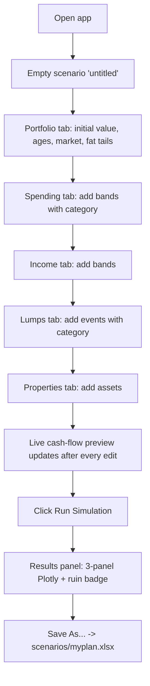
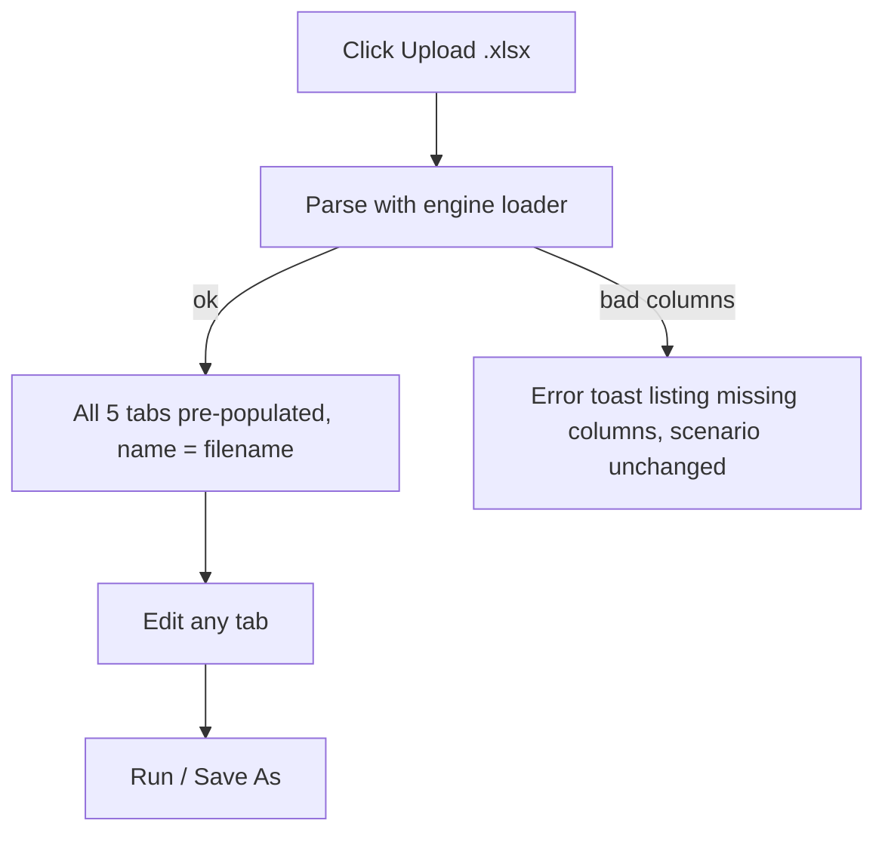
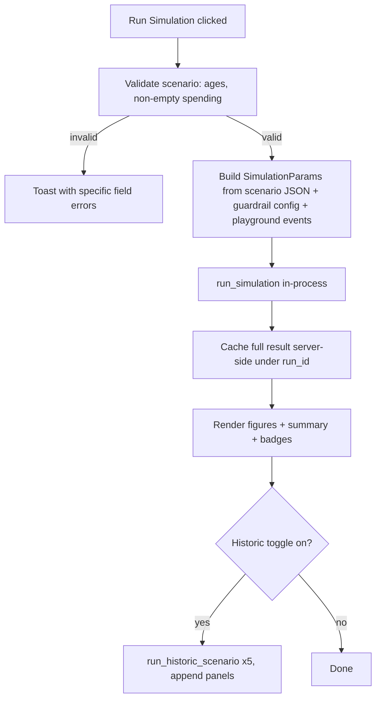
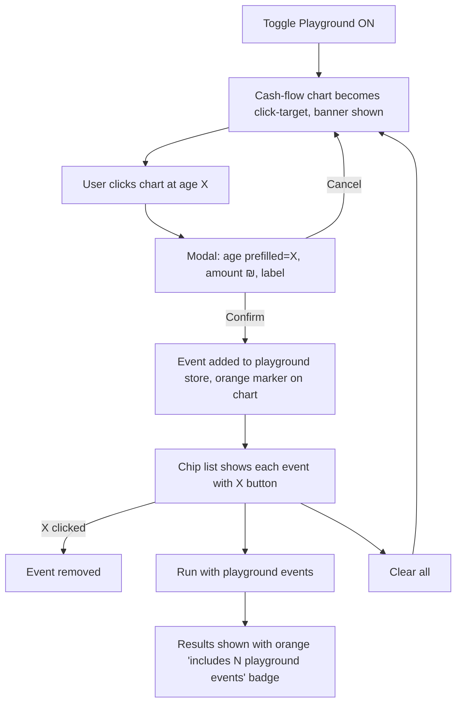
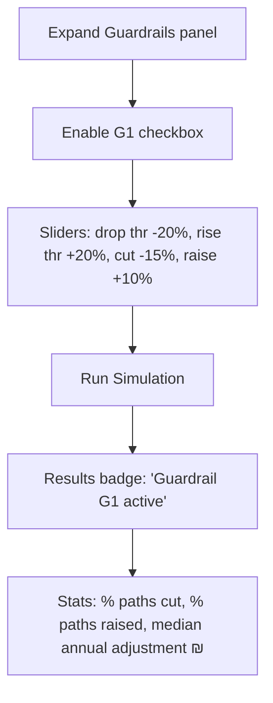
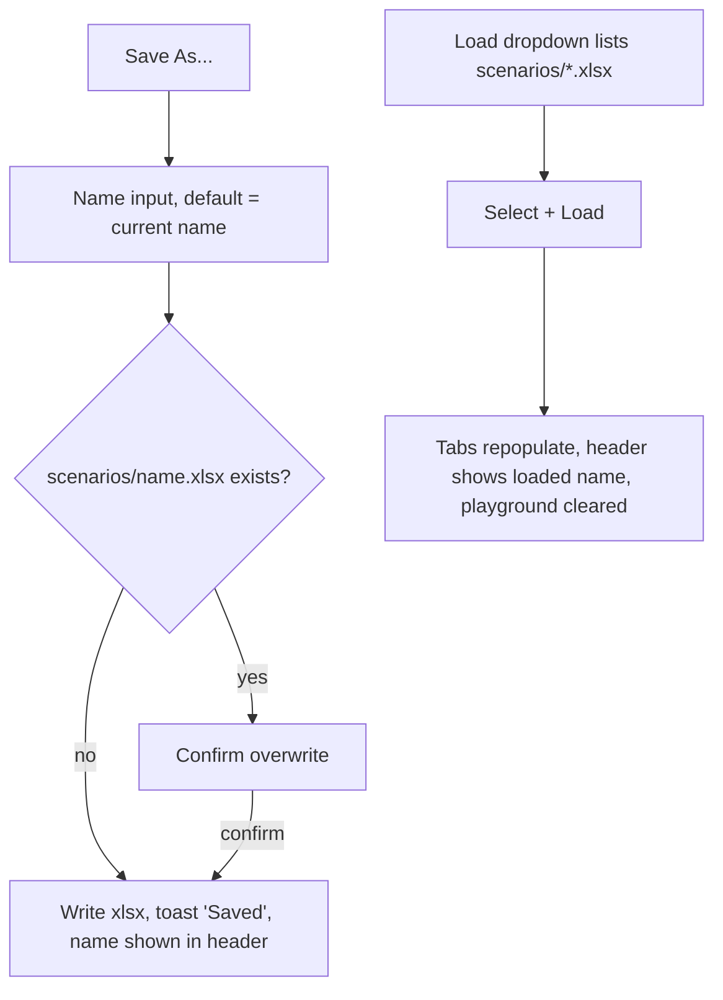

# PRD & Technical Specification — Retirement Simulator Web App (v1)

**Status:** Ready for implementation
**Date:** 2026-07-03
**Source repo:** `retirement_simulation` (existing CLI Monte Carlo simulator)
**Deployment target:** self-hosted, single user, no auth, single machine

This document is the implementation contract. Where the existing code and this
spec disagree, this spec wins — the existing Python files are a reference
implementation, not a locked API. The invariant is **modeling capability**:
every feature the CLI has today must exist in the web app (see §1.3).

---

## 1. Product Overview

### 1.1 Problem statement

The current tool is a CLI that reads an .xlsx scenario, runs a 10,000-path
Monte Carlo retirement simulation (Student-t fat tails, real ₪), and opens
Plotly charts. Iterating on a scenario means editing a spreadsheet, re-running
a command, and waiting for a browser window. There is no way to:

- build or edit a scenario interactively,
- ask "what if a ₪200k surprise hits at age 71?" without editing the file,
- model spending flexibility (cutting discretionary spend after a crash),
- distinguish must-pay spending from nice-to-have spending.

### 1.2 Target users

A single self-hosting user (the author and family) planning retirement in
real (inflation-adjusted) Israeli Shekels. Technical enough to run
`pip install && python app.py`, not interested in editing spreadsheets for
every what-if.

### 1.3 Modeling capability invariant (must all survive the port)

1. Monte Carlo with Student-t fat-tailed returns (configurable df, or normal when disabled)
2. Annual **and** monthly simulation modes
3. Per-path ruin tracking with ruin-age distribution
4. Historic scenario backtesting against real return sequences (1929, 1969, 2000, 2022, IL-1983), with mean-return continuation after the sequence ends
5. Multiple overlapping income bands (overlaps sum)
6. Multiple spending bands (overlaps sum), incl. single-year bands and travel
7. One-off lumps, positive and negative
8. Multiple properties with independent growth distributions and rent
9. Full Plotly suite: cash-flow breakdown bars + net line, portfolio/property percentile bands with 25–75% and 5–95% ribbons, annual draw panel with monthly/rate hover, ruin-probability annotation with color + explanation, historic panels with grey mean-continuation shading

### 1.4 Success metrics

- Building a scenario from scratch to first simulation result: **< 10 minutes**
- Editing one number and re-running: **< 15 seconds** end to end
- A scenario saved from the web app runs **unchanged** through the existing CLI (`python cli.py scenarios/foo.xlsx`) and produces the same ruin probability (same seed)
- Playground what-if (click → amount → re-run): **< 30 seconds**

### 1.5 Scope

**In scope (v1):** scenario builder (5 tabs), spending categories, xlsx
save/load (backward compatible), simulation run + interactive results,
playground mode, guardrail G1, historic-scenario toggle, monthly-mode toggle.

**Out of scope (v1):** auth/multi-user, cloud deployment, scenario diffing or
comparison view, tax modeling, currency other than real ₪, mobile layout,
undo/redo, concurrent runs, guardrails beyond G1 (engine is extensible, UI
only ships G1).

---

## 2. User Flows

### 2.1 First-time scenario build



### 2.2 Upload & edit



### 2.3 Run simulation



### 2.4 Playground mode



### 2.5 Guardrails configuration



### 2.6 Save / load scenario



---

## 3. Tech Stack Recommendation

### 3.1 Framework: **Dash** (with dash-bootstrap-components)

| Criterion | Dash | FastAPI + React | Streamlit |
|---|---|---|---|
| Plotly integration | Native (`dcc.Graph`) — existing figure code ports almost verbatim | Manual: serialize figure JSON, render with react-plotly.js | Native but figures re-render on full rerun |
| Chart click → modal (playground) | Built-in `clickData` on `dcc.Graph` | Full control, most work | Weak: needs `streamlit-plotly-events` hacks, whole-script rerun fights modal state |
| Engine in same process | Yes, callbacks call `run_simulation()` directly | Yes (FastAPI worker) but adds an HTTP API + a second codebase (React, node toolchain) | Yes |
| CRUD tables for bands | `dash_table.DataTable` editable/deletable rows out of the box | Build or import a grid component | `st.data_editor`, decent |
| UX ceiling | Good enough for a single-user tool | Highest | Lowest |
| Complexity / maintenance | One Python codebase | Two codebases, build step, CORS, schema duplication | One file, but fights you on stateful interactions |

**Decision: Dash.** The two hardest requirements — embedding the existing
Plotly figures interactively (R4) and click-on-chart playground events (R5) —
are both native Dash features (`dcc.Graph` + `clickData`). FastAPI+React buys
a UX ceiling this single-user tool doesn't need at the cost of a second
codebase. Streamlit fails R5 cleanly (its rerun model makes
click-to-place-then-modal fragile).

**Tradeoffs accepted:** Dash callback graphs get tangled if undisciplined —
mitigated by the exact callback inventory in §5 (implementers must not invent
extra callbacks). Dash styling is utilitarian — acceptable for v1.

Pinned stack: `dash>=2.17`, `dash-bootstrap-components>=1.6`, `plotly>=5`,
`numpy`, `pandas`, `openpyxl`, `pytest`. No other dependencies. Do not add
`dash-extensions`, Redux-like state libs, or a database.

### 3.2 Process model

Single process: `python -m webapp.app` runs the Dash dev server (Flask
underneath) on `127.0.0.1:8050`. The simulation runs synchronously inside the
callback — 10,000 paths × ~40 years of numpy is well under 2 seconds; no task
queue, no background callbacks, no websockets. If monthly mode × 10k paths
ever exceeds ~10s, switch that one callback to Dash `background=True` with a
DiskCache manager — not before.

### 3.3 Storage

- **Saved scenarios:** `scenarios/*.xlsx` on the local filesystem, one file
  per scenario, filename = scenario name (sanitized: `[A-Za-z0-9_\-]`,
  spaces → `_`). No database, no index file — the directory listing *is* the
  scenario list.
- **Simulation results:** server-side in-memory dict `RESULTS_CACHE:
  dict[str, dict]` (module-level), keyed by `run_id` (uuid4 hex). Keep the
  last 5 entries, evict oldest (`OrderedDict.popitem(last=False)`). Results
  contain multi-MB ndarrays and must never be put in a `dcc.Store`.
- **Session state (scenario being edited, playground events, guardrail
  config):** browser-side `dcc.Store` components (JSON, all < 100 KB). Lost
  on hard refresh unless saved — acceptable for v1, and the header shows an
  "unsaved changes" dot as the mitigation.

---

## 4. Data Schema

### 4.1 Scenario object (in-memory / dcc.Store JSON)

This is the single source of truth in the UI. All monetary inputs are
**monthly ₪** exactly as the user typed them (matching the spreadsheet
convention); conversion to annual happens only when constructing
`SimulationParams` in the backend.

```json
{
  "$schema": "scenario.v1",
  "name": "untitled",
  "portfolio": {
    "initial_portfolio": 3000000,
    "start_age": 60,
    "end_age": 95,
    "market": "IL",
    "fat_tails_enabled": true,
    "fat_tails_df": 5,
    "mode": "annual",
    "n_paths": 10000,
    "random_seed": 42
  },
  "spending_bands": [
    {
      "id": "sb-1",
      "age_from": 60,
      "age_to": 95,
      "amount_monthly": 25000,
      "label": "Base living",
      "category": "strict"
    },
    {
      "id": "sb-2",
      "age_from": 60,
      "age_to": 80,
      "amount_monthly": 5000,
      "label": "Travel",
      "category": "lifestyle"
    }
  ],
  "income_bands": [
    {
      "id": "ib-1",
      "age_from": 60,
      "age_to": 67,
      "amount_monthly": 12000,
      "label": "Consulting"
    }
  ],
  "lumps": [
    {
      "id": "lp-1",
      "age": 70,
      "amount": -400000,
      "label": "Gift to kids",
      "category": "gifts"
    }
  ],
  "properties": [
    {
      "id": "pr-1",
      "start_age": 60,
      "initial_value": 2500000,
      "rent_monthly": 6000,
      "label": "TLV apartment"
    }
  ]
}
```

Field rules (validate on Run and on Save; show toast listing every violation):

| Field | Type | Constraint |
|---|---|---|
| `name` | str | non-empty after sanitization |
| `initial_portfolio` | number | ≥ 0 |
| `start_age`, `end_age` | int | 18 ≤ start < end ≤ 110 |
| `market` | enum | `"US" \| "UK" \| "IL"` |
| `fat_tails_df` | int | 3–10; ignored when `fat_tails_enabled=false` |
| `mode` | enum | `"annual" \| "monthly"` |
| `n_paths` | int | 100–50000, default 10000 |
| `random_seed` | int or null | null = nondeterministic |
| band `age_from`/`age_to` | int | start_age ≤ age_from ≤ age_to ≤ end_age; `age_from == age_to` is a valid single-year band |
| band `amount_monthly` | number | ≥ 0 (spending stores magnitude; sign is applied by the engine) |
| lump `amount` | number | ≠ 0; positive = inflow, negative = outflow |
| `category` | enum | `"strict" \| "lifestyle" \| "gifts"` — required on every spending band and every lump |
| `id` | str | UI-only row key (`"sb-<n>"` etc.); never persisted to xlsx, never read by the engine |

Market µ/σ are **not** stored in the scenario — they are looked up from
`engine.markets` at run time so the displayed values and the simulated values
can never diverge:

```python
MARKETS = {
  "US": {"mu": 0.030, "sigma": 0.12, "housing_mu": 0.010, "housing_sigma": 0.06},
  "UK": {"mu": 0.053, "sigma": 0.20, "housing_mu": 0.024, "housing_sigma": 0.07},
  "IL": {"mu": 0.042, "sigma": 0.13, "housing_mu": 0.018, "housing_sigma": 0.08},
}
```

### 4.2 Playground event schema (dcc.Store, ephemeral — never saved to xlsx)

```json
[
  {
    "id": "pg-a1b2c3",
    "age": 71,
    "amount": -200000,
    "label": "Roof collapse",
    "category": "strict"
  }
]
```

`category` is fixed to `"strict"` for playground events (an *unexpected*
event is by definition non-negotiable, and this keeps guardrails from
scaling it). `id` is `"pg-" + uuid4().hex[:6]`.

### 4.3 Guardrail config schema (dcc.Store)

```json
{
  "guardrails": [
    {
      "type": "volatility_discretionary_scaling",
      "enabled": false,
      "drop_threshold": 0.20,
      "rise_threshold": 0.20,
      "cut_pct": 0.15,
      "raise_pct": 0.10
    }
  ]
}
```

All four numbers are positive magnitudes; direction is implied by the field
name. Slider ranges: thresholds 0.05–0.50 step 0.01, adjustments 0.00–0.50
step 0.01.

### 4.4 xlsx persistence — category tags without breaking the CLI

**Decision: category is a bracketed suffix on the existing `_comment`
column.** Example: `spending_comment = "Housing [strict]"`. Rationale: the
file's column set stays byte-identical to today's schema, so the existing CLI
loader (`read_scenario_data`, which selects columns by name and treats the
comment as an opaque label) works unchanged, and older files load into the
web app with defaulted categories. Adding new columns would also survive the
current loader, but the suffix keeps one schema instead of two and works for
`.numbers` files too.

**Writer** (`engine/params.py :: scenario_to_xlsx`):
- One sheet. Columns exactly:
  `initial_portfolio, start_age, end_age, spending_age_from, spending_age_to,
  spending_amount_monthly, spending_comment, income_age_from, income_age_to,
  income_amount_monthly, income_comment, lump_age, lump_amount, lump_comment,
  properties_age_from, properties_initial_value, properties_rent_monthly,
  properties_comment, travel_age_from, travel_age_to, travel_amount_annual,
  travel_comment`
- Row 0 carries the scalars (`initial_portfolio`, `start_age`, `end_age`);
  each column group is filled top-down independently (this is how the
  existing example file works — the groups are independent dropna'd blocks).
- Comment cells are written as `f"{label} [{category}]"`. If the label is
  empty, write `f"[{category}]"`.
- The travel column group is **always written empty** (headers only). Travel
  is just a spending band with a category in the new model; writing it into
  `spending_*` keeps one code path. The empty travel group keeps the CLI
  loader's `dropna()` happy (it yields zero travel rows).
- Playground events are never written.

**Reader** (`engine/params.py :: scenario_from_xlsx`) parses categories with:

```python
CATEGORY_RE = re.compile(r"^(.*?)\s*\[(strict|lifestyle|gifts)\]\s*$")

def split_category(comment: str, default: str) -> tuple[str, str]:
    m = CATEGORY_RE.match(str(comment or ""))
    if m:
        return m.group(1).strip(), m.group(2)
    return str(comment or "").strip(), default
```

Defaults when no tag is present (i.e., loading a legacy file):
- spending rows → `strict` (conservative: guardrails never cut untagged spending)
- travel rows → `lifestyle` (loaded as ordinary spending bands, annual amount ÷ 12 → `amount_monthly`)
- lumps → `gifts` if `amount < 0`, else `strict` (category is inert for inflows; guardrails only scale outflows)

**Round-trip guarantee (tested in Phase 1):**
`scenario_from_xlsx(scenario_to_xlsx(s)) == s` up to `id` fields, and the
written file loads through the *old* `read_scenario_data` without error.

### 4.5 Engine dataclasses (refactored `engine/params.py`)

```python
@dataclass
class Band:
    start: int
    end: int
    annual: float            # engine-side amounts are ANNUAL real ₪
    label: str = ""
    category: str = "strict" # strict | lifestyle | gifts (income bands ignore it)

@dataclass
class Lump:
    age: int
    amount: float            # annual-mode ₪; positive inflow, negative outflow
    label: str = ""
    category: str = "strict"

@dataclass
class Property:
    start_age: int
    initial_value: float
    rent_annual: float
    growth_mean: float
    growth_sd: float
    label: str = ""

@dataclass
class SimulationParams:
    start_age: int
    end_age: int
    initial_portfolio: float
    real_return_mean: float
    real_return_sd: float
    fat_tails_df: Optional[int]      # None => normal distribution
    annual: bool = True
    n_paths: int = 10_000
    random_seed: Optional[int] = 42
    spending_bands: list[Band] = field(default_factory=list)
    income_bands: list[Band] = field(default_factory=list)
    lumps: list[Lump] = field(default_factory=list)
    properties: list[Property] = field(default_factory=list)
    scenario_name: str = ""          # replaces the input_file hack in figures

    @classmethod
    def from_scenario(cls, scenario: dict,
                      playground_events: list[dict] | None = None) -> "SimulationParams":
        """Build from the §4.1 JSON. Converts monthly→annual (×12),
        resolves market µ/σ from engine.markets, appends playground
        events as Lumps."""
```

Refactor notes (all are **required** fixes, not optional cleanups):
1. `SimulationParams` becomes a plain dataclass; the current
   `scenario_data`-dict constructor moves to a
   `from_legacy_scenario_data(scenario_data)` classmethod used by the CLI.
2. `sample_real_returns` must accept and use the caller's `rng` — today it
   silently creates its own generator, so seeded fat-tail runs are **not
   reproducible**. Pass `rng=np.random.default_rng(params.random_seed)`.
3. Monthly mode must honor `fat_tails_df` (same Student-t rescaling, monthly
   µ/σ) and must return the same result keys as annual mode
   (`bal_over_age`→ keep both names or normalize to `bal_over_time`;
   normalize to: `bal_over_time`, `prop_over_time`, `time_axis`, plus the
   full `summary` with percentiles). The figure code branches on
   `params.annual`, not on dict-key sniffing.
4. `run_simulation` result gains `"scenario_name"` (from params) — figures
   stop reading `results["input_file"]`.

---

## 5. Component Interface — Dash callback inventory

This is the complete callback list. Implementers: do not add callbacks beyond
this list without a spec change; use `dash.ctx.triggered_id` where multiple
Inputs share a callback; every Output written by two callbacks uses
`allow_duplicate=True` + `prevent_initial_call='initial_duplicate'` as noted.

**Component IDs referenced below**

Stores: `store-scenario`, `store-playground`, `store-guardrails`,
`store-run-id` (all `dcc.Store`, storage_type `session` except
`store-playground` and `store-run-id` which are `memory`).
Tables: `tbl-spending`, `tbl-income`, `tbl-lumps`, `tbl-properties`
(`dash_table.DataTable`, `editable=True`, `row_deletable=True`; category
column uses the DataTable dropdown feature).
Graphs: `graph-preview` (builder cash-flow preview, the playground click
target), `graph-results` (single figure with subplots, mirrors
`plot_cash_flow`).

### C1 — Scenario ⇄ UI sync

| # | Callback | Inputs | State | Outputs | Behavior |
|---|---|---|---|---|---|
| 1 | `hydrate_tabs` | `store-scenario.data` | — | all portfolio form fields; `tbl-spending.data`, `tbl-income.data`, `tbl-lumps.data`, `tbl-properties.data`; `header-scenario-name.children` (all `allow_duplicate` where also written by #2) | Store → widgets. Fires on load/upload/initial. Guard: if `ctx.triggered_id` indicates the change originated from a widget callback echo, `no_update` everything (compare serialized values). |
| 2 | `collect_edits` | every portfolio form field's `value`; `tbl-*.data` (`data_timestamp` pattern) ; add-row buttons `btn-add-spending.n_clicks` etc. | `store-scenario.data` | `store-scenario.data` (`allow_duplicate`) | Widgets → store. On add-row button: append a default row (`age_from=start_age, age_to=end_age, amount=0, label="", category="lifestyle"`). Marks header dirty-dot. |
| 3 | `market_info` | `dd-market.value` | — | `lbl-market-mu-sigma.children` | Shows `µ=4.2% σ=13.0%` for the selected market from `engine.markets`. |
| 4 | `fat_tail_controls` | `chk-fat-tails.value` | — | `slider-df.disabled` | Slider (3–10, default 5) greyed when unchecked. |

### C2 — Persistence

| # | Callback | Inputs | State | Outputs | Behavior |
|---|---|---|---|---|---|
| 5 | `upload_xlsx` | `upload-scenario.contents` | `upload-scenario.filename` | `store-scenario.data` (dup), `toast.children` | Decode base64 → `scenario_from_xlsx`. On parse failure: error toast naming the missing columns, store untouched. Sets `name` from filename stem. Clears `store-playground`. |
| 6 | `save_scenario` | `btn-save-confirm.n_clicks` | `input-save-name.value`, `store-scenario.data` | `toast.children`, `dd-load-scenario.options`, `modal-save.is_open` | Validate (§4.1), sanitize name, `scenario_to_xlsx` → `scenarios/<name>.xlsx`. Overwrite requires the confirm checkbox in the save modal to be ticked when the file exists. Refreshes the load dropdown. |
| 7 | `open_save_modal` | `btn-save.n_clicks` | `store-scenario.data` | `modal-save.is_open`, `input-save-name.value`, `chk-overwrite.style` | Prefills name; shows overwrite checkbox only if file exists. |
| 8 | `load_scenario` | `btn-load.n_clicks` | `dd-load-scenario.value` | `store-scenario.data` (dup), `store-playground.data` (dup, cleared), `toast.children` | Reads `scenarios/<sel>.xlsx` via `scenario_from_xlsx`. |
| 9 | `refresh_scenario_list` | `interval-scenarios.n_intervals` (30 s) , app load | — | `dd-load-scenario.options` | `sorted(p.stem for p in Path("scenarios").glob("*.xlsx"))`. |

### C3 — Preview & playground

| # | Callback | Inputs | State | Outputs | Behavior |
|---|---|---|---|---|---|
| 10 | `render_preview` | `store-scenario.data`, `store-playground.data`, `switch-playground.value` | — | `graph-preview.figure`, `div-playground-chips.children`, `banner-playground.style` | Builds the cash-flow preview via `engine.figures.cash_flow_figure(params, playground_events)`. Playground events drawn as **orange** (`#FF9800`) diamond markers + bars. Chips: one `dbc.Badge` per event with text `"age 71 · −₪200,000 · Roof collapse"` and an X button `{'type':'pg-remove','index':<id>}`. Banner "PLAYGROUND — click the chart to add an event" visible only when the switch is on. |
| 11 | `chart_click` | `graph-preview.clickData` | `switch-playground.value` | `modal-playground.is_open`, `input-pg-age.value` | If switch off → `no_update`. Else open modal with `age = round(clickData['points'][0]['x'])` clamped to `[start_age, end_age]`. |
| 12 | `confirm_playground_event` | `btn-pg-confirm.n_clicks` | `input-pg-age.value`, `input-pg-amount.value`, `input-pg-label.value`, `store-playground.data` | `store-playground.data` (dup), `modal-playground.is_open` | Validates amount ≠ 0. Appends §4.2 object. Amount is entered as a signed one-off ₪ total (not monthly). |
| 13 | `remove_playground_event` | `{'type':'pg-remove','index':ALL}.n_clicks` | `store-playground.data` | `store-playground.data` (dup) | Removes by id (use `ctx.triggered_id['index']`; ignore fires with `n_clicks` None/0). |
| 14 | `clear_playground` | `btn-pg-clear.n_clicks` | — | `store-playground.data` (dup) | `[]`. |

### C4 — Guardrails

| # | Callback | Inputs | State | Outputs | Behavior |
|---|---|---|---|---|---|
| 15 | `collect_guardrails` | `chk-g1-enable.value`, `slider-g1-drop.value`, `slider-g1-rise.value`, `slider-g1-cut.value`, `slider-g1-raise.value` | — | `store-guardrails.data` | Serializes to §4.3. |
| 16 | `toggle_guardrail_panel` | `btn-guardrails-header.n_clicks` | `collapse-guardrails.is_open` | `collapse-guardrails.is_open` | Collapsible panel. |

### C5 — Run

| # | Callback | Inputs | State | Outputs | Behavior |
|---|---|---|---|---|---|
| 17 | `run_simulation_cb` | `btn-run.n_clicks`, `btn-run-playground.n_clicks` | `store-scenario.data`, `store-playground.data`, `store-guardrails.data`, `switch-historic.value` | `graph-results.figure`, `div-summary.children`, `div-result-badges.children`, `store-run-id.data`, `toast.children` | See §5.1. `btn-run` ignores playground events; `btn-run-playground` includes them. Wrapped in `dcc.Loading`. |

### 5.1 Shared simulation request/response (internal contract)

Both run buttons funnel into one function — this is the shared schema R4/R5
require, expressed as Python since there is no HTTP boundary:

```python
def execute_run(scenario: dict,
                guardrail_cfg: dict,
                playground_events: list[dict],   # [] when btn-run
                include_historic: bool) -> RunOutput:

@dataclass
class RunOutput:
    run_id: str
    figure: go.Figure          # full multi-panel results figure
    summary: dict              # engine summary + guardrail_stats
    badges: list[str]          # e.g. ["3 playground events", "Guardrail G1 active"]
```

`execute_run` steps: validate → `SimulationParams.from_scenario(scenario,
playground_events)` → `run_simulation(params, guardrails=parse(guardrail_cfg))`
→ optionally 5 × `run_historic_scenario` → `engine.figures.results_figure(...)`
→ cache raw results in `RESULTS_CACHE[run_id]` → return. Any exception →
error toast with the message, previous figure left untouched (`no_update`).

Badges are mandatory whenever applicable (R5: "results panel clearly
indicates whether results include playground events"): orange badge
`"Includes N playground events"`, blue badge `"Guardrail G1 active"`, grey
badge `"Historic scenarios: 5"`. No badges → render `"Baseline run"`.

---

## 6. Component Breakdown

### 6.1 Page layout (single page)

```
┌──────────────────────────────────────────────────────────────┐
│ Header: app title · scenario name (+dirty dot) · Save As ·   │
│         Load ▾ · Upload .xlsx                                │
├──────────────────────────────┬───────────────────────────────┤
│ LEFT COLUMN (builder, 40%)   │ RIGHT COLUMN (results, 60%)   │
│ ┌──────────────────────────┐ │  Run Simulation ▶             │
│ │ Tabs: Portfolio Spending │ │  Run with playground events ▶ │
│ │  Income Lumps Properties │ │  ☐ Include historic scenarios │
│ └──────────────────────────┘ │  [badges row]                 │
│ Playground switch ◯          │  [summary cards: ruin %,      │
│ graph-preview (cash-flow,    │   median estate, p25/p75]     │
│  click target, pg chips)     │  graph-results                │
│ ▸ Guardrails (collapsed)     │  (Cash-flow / Percentiles /   │
│                              │   Draw / +historic panels)    │
└──────────────────────────────┴───────────────────────────────┘
```

### 6.2 Components

| Component | Renders |
|---|---|
| **Portfolio tab** | Numeric inputs: initial portfolio (monthly convention does *not* apply here — it's a balance), start/end age. Market dropdown + live `µ/σ` label (#3). Fat-tails switch + df slider 3–10. Mode radio annual/monthly. Advanced (collapsed): n_paths, seed. |
| **Spending tab** | `tbl-spending` columns: `age_from, age_to, amount_monthly, label, category(dropdown)`; Add-band button. Category cells get per-category background color (DataTable `style_data_conditional`). |
| **Income tab** | `tbl-income`: `age_from, age_to, amount_monthly, label`. |
| **Lumps tab** | `tbl-lumps`: `age, amount (signed ₪), label, category(dropdown)`. |
| **Properties tab** | `tbl-properties`: `start_age, initial_value, rent_monthly, label`. Growth µ/σ come from the scenario's market (shown as read-only caption, per-property overrides are out of scope v1). |
| **Preview chart** | Cash-flow bars by component. Colors (§6.3). Net line black. Playground markers orange. |
| **Guardrails panel** | G1 block per §2.5 flow. |
| **Results panel** | Summary cards; badges; one `dcc.Graph` whose figure has 3 subplot rows (+1 per historic scenario when toggled) — a straight port of `plot_cash_flow` / `plot_with_historic` that **returns** the figure instead of calling `fig.show()`, plus the guardrail stats line and the ruin annotation (ℹ️ hover with the existing `get_ruin_explanation` table, green <3% / orange <10% / red otherwise). All axes/tooltips labelled in real ₪ with `₪%{y:,.0f}`-style formats. |

### 6.3 Category color coding (single constant, used by builder tables, preview chart, and results cash-flow panel)

```python
CATEGORY_COLORS = {
    "strict":    "#B71C1C",   # dark red
    "lifestyle": "#F06292",   # pink
    "gifts":     "#8E44AD",   # purple
}
PLAYGROUND_COLOR = "#FF9800"  # orange
# income bands keep the existing green ramp, rent the blue ramp,
# positive lumps grey — unchanged from visualization.py
```

`build_cash_flow_series` (moved to `engine/figures.py`) changes exactly one
rule: spending-band and negative-lump colors come from
`CATEGORY_COLORS[item.category]` (shade-stepped ±10% lightness per index for
distinguishability) instead of the red ramp.

### 6.4 State management summary

| State | Where | Why |
|---|---|---|
| Scenario being edited | `dcc.Store` session (browser) | Survives soft navigation; small JSON |
| Playground events | `dcc.Store` memory (browser) | Ephemeral by requirement (R5) — gone on refresh, cleared on load/upload |
| Guardrail config | `dcc.Store` session | Small; user expects it to stick |
| Saved scenarios | `scenarios/*.xlsx` server FS | Interop with CLI is the whole point |
| Raw simulation results (ndarrays) | server `RESULTS_CACHE` | Too big for the browser; only figure JSON crosses the wire |
| Figures | Plotly figure JSON via `dcc.Graph.figure` callback output | Native Dash transport; no HTML embeds, no image exports |

---

## 7. Guardrail Engine Design

### 7.1 Engine API change

```python
def run_simulation(params: SimulationParams,
                   guardrails: list[GuardrailConfig] | None = None) -> dict:
```

`guardrails=None`/`[]` ⇒ **bit-identical behavior and output to today**
(this is a tested invariant, see §9.3). The result dict gains one key,
`"guardrail_stats"` (`None` when no guardrail ran).

```python
@dataclass
class GuardrailConfig:
    type: str                    # registry key
    options: dict                # type-specific, validated by the handler
```

### 7.2 Spending decomposition

To scale categories per path, spending stops being a single per-year scalar
and becomes per-category arrays (annual mode shown; monthly is the same with
`/12` amounts and month indices):

```python
CATEGORIES = ("strict", "lifestyle", "gifts")

# spend_by_cat[c] : shape (years,)   — from spending bands of category c
# lump_out_by_cat[c] : shape (years,) — negative lumps of category c (as positive magnitudes)
# lump_in : shape (years,)            — positive lumps (never scaled)
```

Playground events arrive already merged into `params.lumps` (category
`strict` ⇒ never scaled).

### 7.3 G1 pseudocode (vectorized, per path, per year)

Semantics (each path independently, using that path's own **realized market
return** of the *previous* year — not the balance change, so heavy
withdrawals don't self-trigger the cut):

- `port_ret[path, y-1] <= -drop_threshold` ⇒ this year's `lifestyle` + `gifts`
  outflows (bands **and** negative lumps) ×`(1 - cut_pct)`
- `port_ret[path, y-1] >= +rise_threshold` ⇒ ×`(1 + raise_pct)`
- otherwise ×1. Non-cumulative: the multiplier is recomputed fresh every year
  from the previous year's return only. Year 0 has no previous year ⇒ ×1.
- `strict` spending and all inflows are never touched.

```python
class VolatilityDiscretionaryScaling:
    KEY = "volatility_discretionary_scaling"

    def __init__(self, options):
        self.drop = options["drop_threshold"]    # 0.20
        self.rise = options["rise_threshold"]    # 0.20
        self.cut = options["cut_pct"]            # 0.15
        self.raise_ = options["raise_pct"]       # 0.10
        self.triggered_down = None               # (n_paths,) bool, lazily init
        self.triggered_up = None
        self.adjustments = []                    # list of (n_paths,) ₪ deltas

    def multiplier(self, year_idx, port_ret, n_paths):
        """Return per-path multiplier for discretionary outflows this year."""
        mult = np.ones(n_paths)
        if year_idx == 0:
            return mult
        prev = port_ret[:, year_idx - 1]
        down = prev <= -self.drop
        up = prev >= self.rise
        mult[down] = 1.0 - self.cut
        mult[up] = 1.0 + self.raise_
        self.triggered_down |= down
        self.triggered_up |= up
        return mult
```

Integration into the annual loop (replaces the scalar `spend[i]`):

```python
# before the loop
handlers = [GUARDRAIL_REGISTRY[g.type](g.options) for g in (guardrails or [])]
disc_out = spend_by_cat["lifestyle"] + spend_by_cat["gifts"] \
         + lump_out_by_cat["lifestyle"] + lump_out_by_cat["gifts"]   # (years,)
strict_out = spend_by_cat["strict"] + lump_out_by_cat["strict"]      # (years,)

# inside `for i, age in enumerate(ages):`
mult = np.ones(params.n_paths)
for h in handlers:
    mult *= h.multiplier(i, port_ret, params.n_paths)   # (n_paths,)

outflow = strict_out[i] + disc_out[i] * mult            # (n_paths,) — broadcast
cash_delta = incomes[i] + rent_i + lump_in[i] - outflow # (n_paths,)
for h in handlers:
    h.adjustments.append(disc_out[i] * (mult - 1.0))    # signed ₪ per path
bal += cash_delta
# ... withdrawal/ruin/growth code unchanged, but note: cash_delta is now a
# per-path VECTOR, so `withdrawal = np.maximum(0.0, -cash_delta)` already
# works elementwise — the existing np.where logic needs no change.
```

Note the ordering subtlety the implementer must preserve: `port_ret[:, i-1]`
is the return **applied at the end of year i-1** to non-ruined paths, which
is exactly "the portfolio dropped >20% last year". Ruined paths keep
multiplier 1 — harmless, their balance is pinned at 0.

### 7.4 Guardrail stats (added to results)

```python
adjust = np.stack(h.adjustments, axis=0)        # (years, n_paths), signed ₪
guardrail_stats = {
    "type": h.KEY,
    "frac_paths_triggered": float((h.triggered_down | h.triggered_up).mean()),
    "frac_paths_cut":       float(h.triggered_down.mean()),
    "frac_paths_raised":    float(h.triggered_up.mean()),
    # median annual ₪ adjustment across (path, year) cells where it fired:
    "median_adjustment":    float(np.median(adjust[adjust != 0]))
                             if np.any(adjust != 0) else 0.0,
}
```

Rendered in the summary as e.g.:
`Guardrail G1: fired on 34% of paths (cut 28% · raised 11%) · median adjustment −₪38,400/yr`.

### 7.5 Extensibility

```python
GUARDRAIL_REGISTRY: dict[str, type] = {
    VolatilityDiscretionaryScaling.KEY: VolatilityDiscretionaryScaling,
}
```

A future guardrail (e.g. Guyton-Klinger withdrawal rules, spending floors)
subclasses the same two-method protocol (`multiplier(year_idx, port_ret,
n_paths)` + collected stats) and registers itself. `run_simulation`'s
signature never changes again; unknown `type` raises `ValueError` at
parse time, before the loop starts. Do **not** build plugin discovery,
entry-points, or config files for this — the registry dict is the whole
mechanism.

---

## 8. Implementation Phases

Each phase ends green: its acceptance commands run clean before the next
phase starts. Model assignments follow "simplest model that is reliable for
the job"; escalate one tier only if a phase fails its acceptance twice.

### Phase 1 — Engine refactor & xlsx round-trip (no UI)

**Build:** `engine/` package per §10: dataclasses with `category` (§4.5),
`from_scenario` / `from_legacy_scenario_data`, `scenario_to_xlsx` /
`scenario_from_xlsx` (§4.4), seeded-rng fix for `sample_real_returns`,
monthly-mode fat tails + normalized result keys, `guardrails=` parameter
accepted but only `[]` supported, `figures.py` = existing visualization
returning `go.Figure` (plus `cli.py` thin wrapper that keeps `--plot
--historic` working via `fig.show()`).

**Acceptance:**
- `pytest tests/ -q` green, including:
  `test_xlsx_roundtrip` (§4.4 guarantee), `test_legacy_file_loads`
  (`scenario_data_example.xlsx` → categories defaulted per §4.4),
  `test_seed_reproducible` (two runs, seed 42, fat tails on ⇒ identical
  `ruin_probability` — this **fails on today's code**, proving the rng fix),
  `test_engine_baseline` (§9.3).
- `python cli.py scenario_data_example.xlsx` prints the same ruin probability
  as `git stash; python simlulation_main.py scenario_data_example.xlsx`
  (record the number in the test as the baseline).

**LLM:** `claude-sonnet-4-6`. Careful refactor with a backward-compat
contract and numpy semantics — above Haiku/local reliability, below needing
Fable. Local `Qwen3-Coder-30B` may draft the pure-boilerplate xlsx
writer/reader from §4.4, Sonnet reviews.

### Phase 2 — Dash skeleton, builder tabs, save/load/upload

**Build:** `webapp/` layout (§6.1), callbacks #1–#9, preview chart (#10
without playground), validation toasts, `scenarios/` dir.

**Acceptance:**
- `python -m webapp.app` serves on :8050 with zero console errors.
- Playwright (or manual) script: build the §4.1 example via the UI → Save As
  `smoke` → `scenarios/smoke.xlsx` exists → `python cli.py
  scenarios/smoke.xlsx` runs without error.
- Upload `scenario_data_example.xlsx` → all tabs populated, travel appears as
  a lifestyle spending band.
- Edit a cell in `tbl-spending` → preview chart updates within 1 s; category
  colors match §6.3.

**LLM:** `claude-sonnet-4-6` for the store⇄table sync callbacks (#1/#2 —
the circular-update guard is the one genuinely tricky part). Tab layouts,
DataTable column definitions, and the save modal are boilerplate:
`claude-haiku-4-5` or local `Qwen3-Coder-30B`.

### Phase 3 — Run simulation & results panel

**Build:** callback #17 (baseline path only), `execute_run`, `RESULTS_CACHE`,
`results_figure` port of `plot_cash_flow` (3 panels + ruin annotation +
summary cards), historic toggle (`plot_with_historic` port, panels appended).

**Acceptance:**
- Upload example → Run → ruin % in the summary card equals the CLI's output
  for the same file to 3 decimals (same seed).
- Historic toggle on → figure has 8 rows (3 + 5 scenarios), grey
  mean-continuation shading visible on short sequences (2022 panel).
- Hover on draw panel shows annual ₪, monthly ₪, and draw-rate % — identical
  template to `visualization.py:118`.
- Two consecutive runs don't grow memory unboundedly (cache evicts at 5).

**LLM:** `claude-sonnet-4-6`. Mostly a mechanical port of existing figure
code; percentile/ribbon subtleties make it above Haiku grade.

### Phase 4 — Playground mode

**Build:** callbacks #10 (full) –#14, modal, chips, badges, "Run with
playground events" wiring into `execute_run`.

**Acceptance (scripted where possible, manual otherwise):**
- Toggle on → click preview at age ~71 → modal opens with age 71 prefilled.
- Add −₪200,000 "roof" → orange marker at 71; chip with X appears.
- "Run with playground events" → ruin % strictly ≥ baseline run's; badge
  "Includes 1 playground events" shown.
- X on chip → marker gone; "Run" (plain) → baseline ruin % again, badge
  "Baseline run".
- Save As after adding events → written xlsx contains **no** playground rows
  (assert by loading it back).
- Load scenario → playground store cleared.

**LLM:** `claude-sonnet-4-6`. `clickData`/pattern-matching-callback plumbing
has sharp edges but is well-trodden; escalate to `claude-fable-5` only if the
duplicate-output graph deadlocks twice.

### Phase 5 — Guardrail G1

**Build:** §7 in full — spending decomposition, handler, registry, stats,
UI panel (callbacks #15–#16), stats line + badge in results.

**Acceptance:**
- `pytest tests/test_guardrails.py -q` green (see §9.4 for the required
  cases, incl. the no-op invariant).
- UI: enable G1 with defaults on the example scenario → ruin % decreases or
  stays equal vs. baseline (cutting spending after crashes can't hurt);
  stats line renders; disable → baseline number restored exactly.
- Slider cut_pct=0 and raise_pct=0 → results identical to disabled (within
  float equality, same seed).

**LLM:** `claude-fable-5` for `engine/guardrails.py` + the loop integration —
per-path vectorized money math with an exact no-op invariant is where subtle
bugs are expensive and hard to spot; the strongest model earns its cost here.
UI sliders/checkbox/panel: `claude-haiku-4-5`.

### Phase 6 — Hardening, tests, docs

**Build:** full §9.2 smoke checklist automated where cheap (pytest +
`dash.testing` or Playwright for the top 5 items), README section (run
instructions, screenshots), input-validation edge cases (empty scenario,
age_from > age_to, monthly mode run), `requirements.txt` pin.

**Acceptance:** `pytest -q` green; §9.2 checklist executed and checked off in
the PR description; fresh-clone bootstrap (`./setup_venv.sh && python -m
webapp.app`) works.

**LLM:** `claude-haiku-4-5` and/or local `Qwen3-Coder-30B` /
`Gemma-4-31B` — test scaffolding, README prose, and validation guards are
exactly their lane. Sonnet reviews the final diff once.

---

## 9. Verification Plan

### 9.1 Run locally

```bash
./setup_venv.sh                      # existing script; adds dash deps
source .venv/bin/activate
pytest -q                            # engine + guardrail tests
python -m webapp.app                 # http://127.0.0.1:8050
python cli.py scenarios/smoke.xlsx   # CLI interop check
```

### 9.2 Smoke test checklist (manual, ~5 minutes, run before every release)

1. ☐ Build a scenario from scratch across all 5 tabs; preview updates live.
2. ☐ Save As `smoke` → toast; file appears in Load dropdown.
3. ☐ Hard-refresh; Load `smoke` → all tabs repopulate, header shows `smoke`.
4. ☐ Run Simulation → 3-panel figure + ruin badge with correct color band.
5. ☐ `python cli.py scenarios/smoke.xlsx` → ruin probability matches the UI
   summary card to 3 decimals (seed 42 both sides).
6. ☐ Playground on → click age → modal → add −₪200k → orange marker + chip.
7. ☐ Run with playground events → badge shows event count; ruin ≥ step 4.
8. ☐ Remove event via X, Clear all → markers gone; plain Run → step-4 number.
9. ☐ Enable G1 defaults → Run → guardrail badge + stats line; ruin ≤ step 4.
10. ☐ Disable G1 → Run → exactly the step-4 number again.
11. ☐ Historic toggle → 5 extra panels, 2022 panel shows grey continuation.
12. ☐ Monthly mode → runs, figure renders with age x-axis (not months).

### 9.3 Required pytest integration test (engine baseline)

```python
# tests/test_engine_baseline.py
import numpy as np
from engine.params import SimulationParams, Band, Lump, Property
from engine.simulation import run_simulation

def make_params(**over):
    base = dict(
        start_age=60, end_age=95, initial_portfolio=3_000_000,
        real_return_mean=0.042, real_return_sd=0.13, fat_tails_df=5,
        annual=True, n_paths=10_000, random_seed=42,
        spending_bands=[Band(60, 95, 300_000, "base", "strict"),
                        Band(60, 80, 60_000, "travel", "lifestyle")],
        income_bands=[Band(60, 67, 144_000, "consulting")],
        lumps=[Lump(70, -400_000, "gift", "gifts")],
        properties=[Property(60, 2_500_000, 72_000, 0.018, 0.08, "apt")],
    )
    base.update(over)
    return SimulationParams(**base)

def test_ruin_probability_known_scenario():
    out = run_simulation(make_params())
    ruin = out["summary"]["ruin_probability"]
    # Baseline captured once from the verified Phase-1 build; the exact
    # value is pinned because the seed is fixed. Tolerance covers numpy
    # version drift in RNG streams across platforms.
    assert 0.0 <= ruin <= 1.0
    baseline = out  # first run
    again = run_simulation(make_params())
    assert again["summary"]["ruin_probability"] == ruin          # seeded determinism
    np.testing.assert_array_equal(baseline["bal_over_time"],
                                  again["bal_over_time"])

def test_guardrails_none_is_noop():
    a = run_simulation(make_params())
    b = run_simulation(make_params(), guardrails=[])
    assert a["summary"] == b["summary"]
```

At the end of Phase 1, run once, print `ruin`, and replace the range assert
with `assert abs(ruin - <printed value>) < 1e-9` — a pinned regression value,
plus a documented looser tolerance (`< 0.005`) guard kept as a second assert
for cross-platform runs.

### 9.4 Required guardrail tests (`tests/test_guardrails.py`)

- Deterministic micro-case: 3 paths, hand-crafted `port_ret` where path 0
  crashes −25% in year 3 → assert path 0's year-4 discretionary spend is
  ×0.85, strict spend untouched, paths 1–2 unchanged.
- Symmetric: +25% year → ×1.10 next year.
- `cut_pct=0, raise_pct=0` ⇒ output equals guardrail-disabled run exactly.
- Stats: `frac_paths_cut` equals the hand-countable fraction in the
  micro-case.

---

## 10. File & Folder Structure

```
retirement_simulation/
├── engine/                        # simulation core — importable by CLI, web, tests
│   ├── __init__.py
│   ├── markets.py                 # MARKETS dict (§4.1); replaces configuration.py
│   ├── params.py                  # dataclasses, from_scenario, xlsx read/write (§4.4–4.5)
│   ├── simulation.py              # run_simulation, run_historic_scenario, sample_real_returns
│   ├── guardrails.py              # GuardrailConfig, registry, G1 handler (§7)
│   ├── historic_returns.py        # moved as-is
│   └── figures.py                 # cash_flow_figure, results_figure, historic panels,
│                                  #   get_ruin_explanation, CATEGORY_COLORS — all RETURN figures
├── webapp/
│   ├── __init__.py
│   ├── app.py                     # Dash app factory + layout assembly + run
│   ├── layout.py                  # header, tabs, tables, guardrail panel, results column
│   ├── callbacks.py               # the 17 callbacks of §5 (split into callbacks_*.py
│   │                              #   only if this file exceeds ~600 lines)
│   └── assets/
│       └── style.css              # category colors as CSS vars, layout tweaks
├── scenarios/                     # saved .xlsx (gitignored except .gitkeep)
│   └── .gitkeep
├── tests/
│   ├── test_engine_baseline.py    # §9.3
│   ├── test_guardrails.py         # §9.4
│   ├── test_xlsx_roundtrip.py     # §4.4 guarantee + legacy-file load
│   └── test_webapp_smoke.py       # app boots, execute_run returns a figure
├── cli.py                         # thin CLI: old flags, calls engine + fig.show()
├── scenario_data_example.xlsx     # unchanged fixture
├── requirements.txt               # + dash, dash-bootstrap-components, openpyxl, pytest
├── setup_venv.sh
└── README.md                      # + "Web app" section (Phase 6)
```

`simlulation_main.py`, `simulation_params.py`, `visualization.py`,
`configuration.py` are deleted at the end of Phase 1 (their content moves
into `engine/`); `cli.py` preserves the user-facing command. `hello.py` and
`agent-runs/` are unrelated scratch and stay untouched.

---

## Appendix A — Known defects in the current code that Phase 1 must fix

1. `simlulation_main.py:31` — `sample_real_returns` creates its own RNG,
   ignoring `params.random_seed`; fat-tail runs are not reproducible.
2. Monthly mode ignores `fat_tails_df` entirely and returns a different
   result-dict shape (no percentile summary, ndarray values inside
   `summary`); normalize per §4.5 note 3.
3. `results["input_file"]` is injected by the CLI after `run_simulation`
   and read by the figure code — replace with `params.scenario_name`.
4. `visualization.py:78` — spending color index uses `len(series)` instead of
   the band index; superseded by category colors (§6.3) anyway.
5. Figure code reads market µ/σ from module-level config rather than the
   params that actually ran — after refactor, figures read
   `params.real_return_mean/sd` so the title can never disagree with the run.
